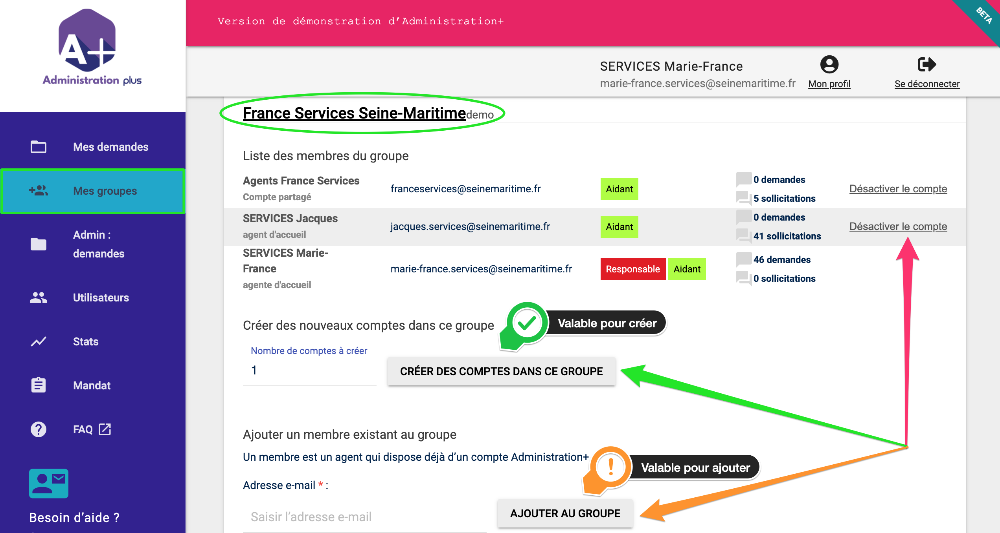
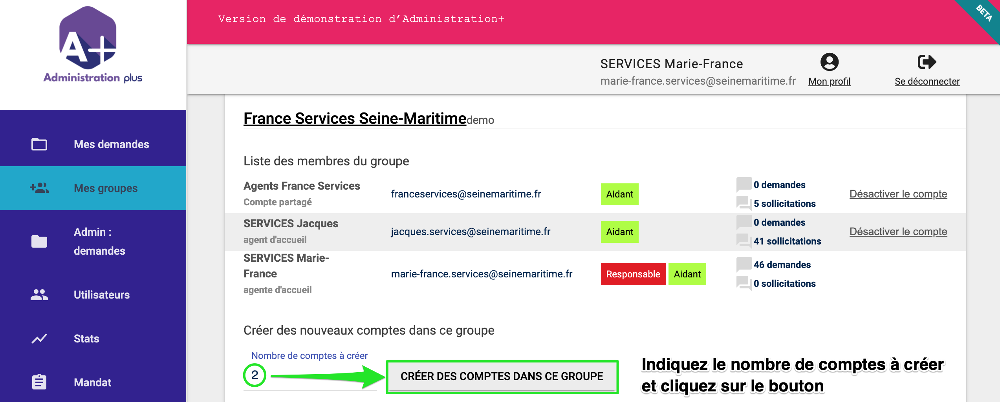
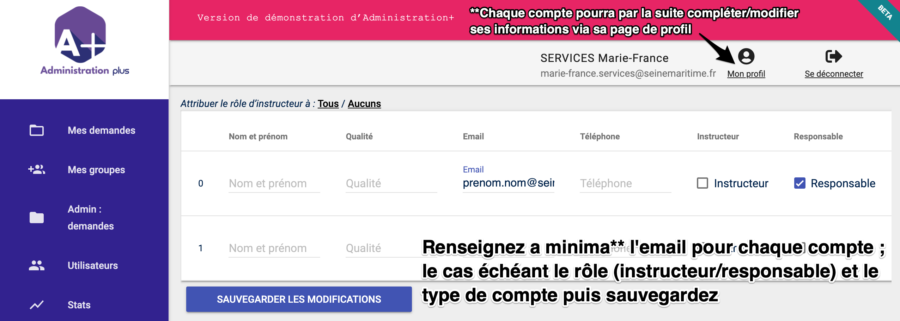

# Ajouter un utilisateur


**Seuls les "Responsables de groupe" peuvent créer de nouveaux comptes** Administration+ et leur attribuer le rôle de responsable et/ou aidant et/ou instructeur. 


## Méthode 1 : via l'onglet Mes groupes

### 1- Cliquer sur l'onglet Mes groupes dans le menu latéral

La liste de vos groupes et utilisateurs par groupe s'affiche :


_cliquer sur le nom d’un groupe permet par ailleurs au responsable d’accéder à la page dédiée où nom, **description succincte et description détaillée** du groupe sont éditables_


### 2- Sélectionner le groupe concerné, renseigner **le nombre de comptes à y créer** et cliquer sur le bouton : CRÉER DES COMPTES DANS CE GROUPE

### 3- Renseigner a minima **l’email \(obligatoire\) pour chaque compte à créer**

Chacun pourra toujours éditer ses informations par la suite via sa page de profil.


Scrollez \(faites défiler\) à droite pour configurer un éventuel[ compte partagé](https://docs.aplus.beta.gouv.fr/faq/peut-on-partager-un-compte-sur-administration+) par plusieurs agents



 Pensez à cocher le rôle [instructeur](https://docs.aplus.beta.gouv.fr/roles-utilisateur#instructeur) et/ou [responsable de groupe](https://docs.aplus.beta.gouv.fr/roles-utilisateur#responsable-de-groupe) pour les concernés ! _\(Pour rappel : le rôle aidant est déjà affecté à tous les comptes par défaut\)_


Cliquer sur le bouton SAUVEGARDER LES MODIFICATIONS pour créer les comptes.

## Méthode 2 : via l'onglet Utilisateurs

### 1- Cliquer sur l'onglet Utilisateurs dans le menu latéral

La liste de vos groupes et utilisateurs par groupe s'affiche :

### 2- Choisir le groupe concerné, renseigner le nombre d'utilisateurs à ajouter dans ce groupe et cliquer sur le bouton : AJOUTER DES UTILISATEURS DANS LE GROUPE 


 Pour ajouter des utilisateurs, vous devez d'abord choisir le groupe concerné, par exemple sur la capture d'écran ci-dessus : Cher / CAF de Seine Maritine.


### 3- L'écran d'ajout d'utilisateurs apparait :

Saisir pour chaque utilisateur, son Nom et prénom, sa qualité, son e-mail, son téléphone et cocher son rôle : Instructeur et/ou responsable.

Quand vous avez terminé, cliquer sur le bouton SAUVEGARDER LES MODIFICATIONS.

